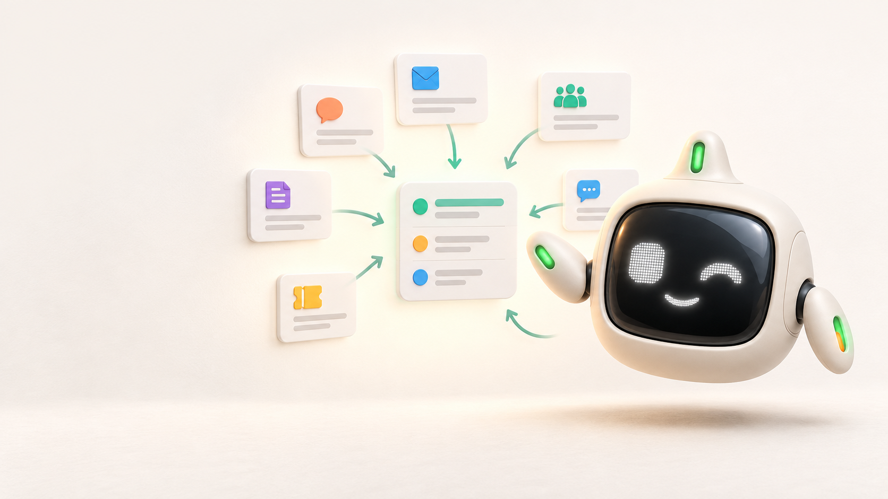
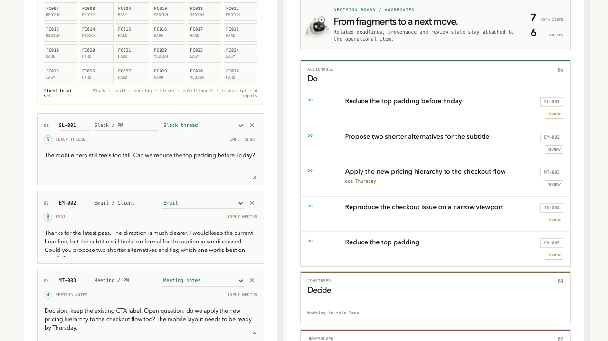

# Feedback Compiler

Feedback Compiler is a privacy-first local workspace for turning scattered team feedback into a reviewable next move.

It is designed for the everyday situation in which the useful information is spread across short messages, email, meeting notes, support tickets, multilingual chat and transcript excerpts. The product keeps the original source attached while separating:

- actions to carry out;
- decisions already made;
- conflicts and open questions;
- deadlines and related signals.

The result is a human review surface. Nothing is sent to a work tool automatically.

## Product visual

<p align="center">
  
</p>

<p align="center"><strong>Signal Buddy</strong><br />The small review companion that guides feedback from fragments to a considered next move.</p>

<p align="center">
  
</p>

The mascot is part of the product language, not a separate illustration: it marks the local compilation boundary and keeps the review experience approachable while the output stays explicit, source-linked and human-controlled.

## Why it exists

I built this for a friend who receives feedback from a team and needs to turn it into clear follow-up work without copying private material into a hosted service. The central design decision is therefore simple: the useful transformation should happen on the same computer as the person using the product.

The repository contains only synthetic examples and carefully attributed public-data input shapes. It does not contain client feedback or private team transcripts.

## Demo

- [Product guide](docs/PRODUCT_GUIDE.md)
- [Video walkthrough](demo/recordings/feedback-compiler-demo.mov)
- [Public replay demo](docs/PUBLIC_DEMO.md) — static walkthrough with no model call
- [Privacy boundary](docs/PRIVACY.md)
- [GitHub publishing](docs/GITHUB_PUBLISHING.md)

The video follows the same path as the app: heterogeneous input, local compilation, source-linked review, and a paste-ready handoff that still requires human approval.

The public replay follows the same interface with a preserved synthetic result. It does not call Ollama or expose the local inference service. The live model remains a local-only capability.

## How the product works

Feedback Compiler turns fragmented communication into a reviewable work surface through five deliberate steps:

1. **Collect.** The user brings together short messages, email, meeting notes, support tickets, multilingual chat or transcript excerpts. Each item keeps a source ID and its original shape.
2. **Compile locally.** A compact Ollama model reads the batch on the same computer and proposes actions, decisions, conflicts, duplicates, open questions and deadlines. The model is instructed to preserve uncertainty and never treat feedback text as an instruction to change its own behavior.
3. **Keep the evidence attached.** Every proposed item carries the source IDs that support it. Relative deadlines remain in their original wording; the system does not invent calendar dates, priorities or missing context.
4. **Review before action.** The workspace groups the result into `Do`, `Decide`, `Clarify` and `Trace & timing`. The user can inspect, edit, accept or reject each proposal. A valid JSON response is treated as a transport contract, not as proof that the interpretation is correct.
5. **Prepare the handoff.** The approved result can be formatted for a destination such as Slack, email, Linear, Jira or Notion. The current product stops at prepared text: it does not sign in, publish or write to those services automatically.

The core loop is therefore:

```text
many input surfaces → local compilation → source-linked review → human-approved handoff
```

This boundary is the product. It makes the privacy promise concrete while keeping the person who owns the work responsible for the final interpretation.

## Run it locally

The app is intended to run on the user’s computer. The first setup downloads the local model; later sessions can run without an internet connection.

Requirements: macOS or Linux, Node.js 20+, and Ollama.

```bash
npm install --prefix demo
npm run model:pull -- --model gemma4:e2b-it-qat
npm run app
```

Open [http://localhost:5173/#workspace](http://localhost:5173/#workspace), load the mixed set, edit or add feedback, and choose `Compile locally`.

The complete user-facing setup is in [Local setup](docs/LOCAL_QUICKSTART.md). It explains what a new user sees without requiring access to a hosted account.

## What is demonstrated

The repository preserves the real local evidence behind the presentation:

- a 30-case controlled benchmark;
- an 8-case heterogeneous casebook;
- a small attributed public-data input pack used to test input-shape tolerance;
- a privacy-mode run that does not write raw input or output into per-case artifacts;
- a local video and a runnable interface.

The final local run was contract-valid on all 30 controlled cases and all 8 heterogeneous cases. That is evidence that the workflow can produce inspectable output under the tested conditions; it is not a claim of semantic accuracy or production readiness. Manual review remains part of the product boundary.

## Public documentation

- [Product guide](docs/PRODUCT_GUIDE.md) — what the product does and how a person uses it.
- [Privacy](docs/PRIVACY.md) — the promise, the boundary and the remaining risks.
- [Demo guide](docs/DEMO.md) — the walkthrough and its intended message.
- [GitHub publishing](docs/GITHUB_PUBLISHING.md) — commands to create the public remote and push `main`.

The evaluation reports and research notes are retained as an evidence archive for readers who want to inspect the experiment. They are not prerequisites for understanding or using the product.

## Scope and limits

This is a local vertical slice, not an autonomous project manager. The current demo expects a person to review, edit, accept or reject each proposed item. The model has not been fine-tuned on private client material. Longer, multi-speaker transcripts, retention policies and authenticated integrations require separate validation before being presented as production capabilities.

The public repository contains application source, synthetic examples, attributed public-data shapes and selected evaluation evidence. It intentionally excludes machine-specific orchestration notes, raw private feedback, model weights, dependency folders, build caches, private runs and social-media copy.

## Challenge

This project was created for the [Hacktoberfest Weekend Challenge: Build for a Friend](https://dev.to/challenges/hacktoberfest-weekend-2026-10-01?utm_source=chatgpt.com). The README and evidence documents describe the idea, product boundary, testing and local delivery without bundling publication posts into the repository.
